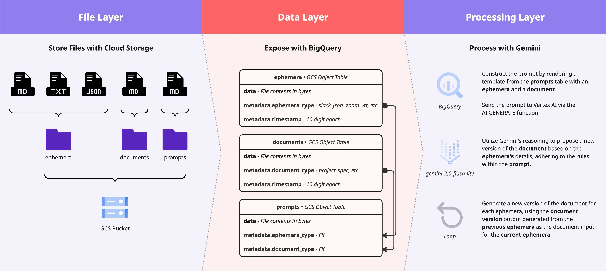

# Kaggle Submission: BigQuery AI - Building the Future of Data

This repository contains the source code and data files for our submission to the Kaggle "[BigQuery AI - Building the Future of Data]([https://www.kaggle.com/competitions/bigquery-ai-hackathon/overview])" competition.

For a detailed explanation of our submission, please refer to the full writeup here: [Auto-Updating Documentation with BigQuery AI](https://www.kaggle.com/competitions/bigquery-ai-hackathon/writeups/auto-updating-documentation).

## Team

This project was a collaborative effort by a team of two engineers:

* **Illya Moskvin** - https://github.com/IllyaMoskvin
* **Jacob Bridges** - https://github.com/jacobbridges

## Submission Overview

### The Problem

**Documentation Divergence** is a common problem in the tech world.

- **Implementation Drift**: Code changes never make it into the documentation.
- **Source Fragmentation**: Authoritative documents contradict each other.
- **Decision Amnesia**: Decisions in conversations never get documented.

In other words

- _"Wouldn't it be nice if my docs were automatically updated whenever I pushed code?"_
- _"I wish the project spec magically got updated whenever we agreed to a client's ask!"_

### The Solution

To solve documentation divergence, look at **changes over time**:

1. Identify the base **documentation** and its **timestamp**.
2. Identify relevant **ephemeral changes** that happened since that time.
3. Generate a **new version** of the documentation.

Once reviewed, this new version is committed to storage, and the cycle repeats.

_"Keep the human in the loop."_

### Architecture

The diagram below illustrates the high-level architecture of our submission, from initial data files to the new version of the documentation ready for human review.

## Getting Started

To replicate our solution, see the full writeup: [Auto-Updating Documentation with BigQuery AI](https://www.kaggle.com/competitions/bigquery-ai-hackathon/writeups/auto-updating-documentation).